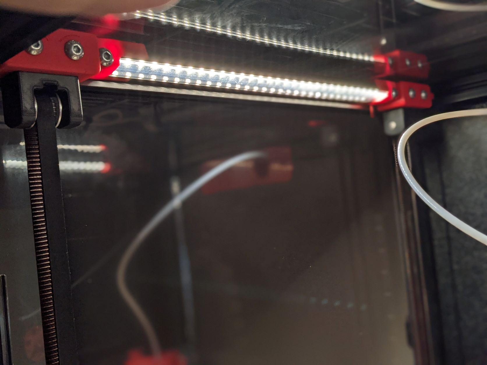

# Voront 2.4 Lighting

This mod mounts low profile LED extrusions to the upper left and right t-slot extrusions of the V2.4.

## BOM

Print the following:
- led_low_profile_extrusion_mount_left.stl
- led_low_profile_extrusion_mount_left_wiring.stl
- led_low_profile_extrusion_mount_right.stl
- led_low_profile_extrusion_mount_right_wiring.stl

BOM:
- 4x M5x25mm BHCS
- 4x M5 Drop-In T-Nuts
- 2x [Low Profile LED Extrusions] (see length table below)
- 2x LED strips (see length table below)

These mounts have been designed around the Muzata U1SW extrusions linked above. They may work with other extrusions but have not been tested.

Required extrusion lengths:

| V2.4 Size | Extrusion Length |
| --------- | ---------------- |
| 250mm     | 246mm            |
| 300mm     | 296mm            |
| 350mm     | 346mm            |

The BOM V2.4 uses 24 volt. Your LED strips should be powered from 24V unless you are providing for a different power source. The printed parts allow only two 24AWG wires to be routed the the strip so RGB strips are not supported. 

## Assembly

1. Cut the extrusions to the appropriate length. Chamfer the edges so that they can slide into the mounts.
1. Cut the LED strips to fit the extrusions. There is some accomodation in the printed parts for the LED strips to be slightly longer than the LED extrusions.
1. Test assemble the parts to ensure everything fits before soldering. Disassemble before soldering.
1. Feed the wires through the mount. Ensure that the polarity matches the LED strip so that they are not twisted when assembled.
1. Solder the wires to the LED strip.
1. Affix the LED strip to the extrusion.
1. Slide the wired end of the mount onto the extrusion. Pull the wires out to take up the slack as you go.
1. Install the mount on the other end of the extrusion.
1. Install the t-nuts in the upper left and right extrusions.
1. Install your new lights with the M5 bolts.
1. Complete the wiring. You can use the available hotend output on MCU Z to power the LED strips if they are 24v.
1. Configure the LEDs in Klipper.

[Low Profile LED Extrusions]: https://www.amazon.com/gp/product/B07KC8P2KD/ref=ppx_yo_dt_b_asin_title_o09_s00?ie=UTF8&psc=1
